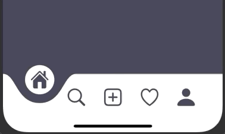

# SwiftUI Animations

Hi! This is a repository where i publish code for the animations you see on my [Instagram (@InnAppsCoding)](https://www.instagram.com/innappscoding/)  
I'm a iOS developer learning Swift and SwiftUI. I create and post animations for fun and to show people how easy it is to create animations in SwiftUI!  
I'm not a UX or UI designer, so use what i post as inspiration and a learning resource for creating animations with SwiftUI! I can't guarantee that all my creations would have passed Apples guidelines 😂  😂

#### If you like what you see, feel free to follow me on my social medias!  
Instagram: [@InnAppsCoding](https://www.instagram.com/innappscoding/)  
Twitter: [@InnAppsCoding](https://twitter.com/InnAppsCoding)  
Facebook: [InnAppsCoding](https://www.facebook.com/innappscoding-103232011437686)  
GitHub: [InnAppsCoding](https://github.com/InnAppsCoding)  

## GIF's and link's to the code 

### Tab Bar

#### [Link to code](https://github.com/InnAppsCoding/InstagramPosts/tree/master/InstaPosts/Animations/TabBar)
---
### Twitter

#### [Link to code](https://github.com/InnAppsCoding/InstagramPosts/tree/master/InstaPosts/Animations/ShareTwitter)
---
### CreditCardFlip

#### [Link to code](https://github.com/InnAppsCoding/InstagramPosts/tree/master/InstaPosts/Animations/CreditCardFlip)
---
### DownloadButton

---
### ShareButton

---
### Menu

---
### Slider

---
### Reddit

---
### HeartLikeButton

---
### Like Button

---
### Star Rating

---
### Darkmode Button

---
### Loading Screen

---
