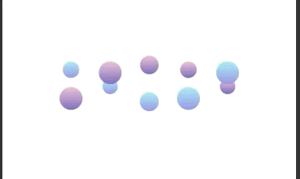
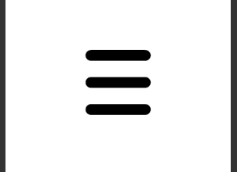
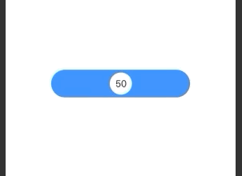
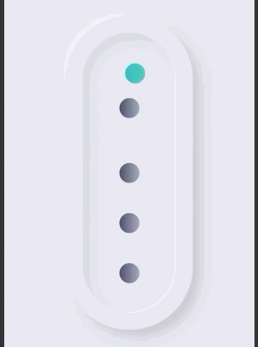

# SwiftUI Animations

Hi! This is a repository where i publish code for the animations you see on my [Instagram (@InnAppsCoding)](https://www.instagram.com/innappscoding/)  
I'm a iOS developer learning Swift and SwiftUI. I create and post animations for fun and to show people how easy it is to create animations in SwiftUI!  

#### If you like what you see, feel free to follow me on my social medias!  
Instagram: [@Inncoder](https://www.instagram.com/inncoder/)  
Twitter: [@Inncoder_](https://twitter.com/Inncoder_)  
Facebook: [InnAppsCoding](https://www.facebook.com/innappscoding-103232011437686)  
GitHub: [Inncoder](https://github.com/Inncoder)  

## GIF's and link's to the code

### DNA Loading

#### [Link to code](https://github.com/InnAppsCoding/SwiftUI-Animations/tree/master/Animations/DNALoading)
---
### Tab Bar

#### [Link to code](https://github.com/InnAppsCoding/SwiftUI-Animations/tree/master/Animations/TabBar)
---
### Twitter

#### [Link to code](https://github.com/InnAppsCoding/SwiftUI-Animations/tree/master/Animations/ShareTwitter)
---
### CreditCardFlip

#### [Link to code](https://github.com/InnAppsCoding/SwiftUI-Animations/tree/master/Animations/CreditCardFlip)
---
### DownloadButton

#### [Link to code](https://github.com/InnAppsCoding/SwiftUI-Animations/tree/master/Animations/Download%20Button)
---
### ShareButton

#### [Link to code](https://github.com/InnAppsCoding/SwiftUI-Animations/tree/master/Animations/Share%20Button)
---
### Menu

#### [Link to code](https://github.com/InnAppsCoding/SwiftUI-Animations/tree/master/Animations/Menu)
---
### Slider

#### [Link to code](https://github.com/InnAppsCoding/SwiftUI-Animations/tree/master/Animations/Slider)
---
### Reddit

#### [Link to code](https://github.com/InnAppsCoding/SwiftUI-Animations/tree/master/Animations/Reddit)
---
### HeartLikeButton

#### [Link to code](https://github.com/InnAppsCoding/SwiftUI-Animations/tree/master/Animations/HeartButton)
---
### Like Button

#### [Link to code](https://github.com/InnAppsCoding/SwiftUI-Animations/tree/master/Animations/LikeButton)
---
### Star Rating

#### [Link to code](https://github.com/InnAppsCoding/SwiftUI-Animations/tree/master/Animations/StarRating)
---
### Darkmode Button

#### [Link to code](https://github.com/InnAppsCoding/SwiftUI-Animations/tree/master/Animations/DarkmodeToggle)
---
### Loading Screen

#### [Link to code](https://github.com/InnAppsCoding/SwiftUI-Animations/tree/master/Animations/LoadingScreen)
---
